# Introduction

This is a MERN stack project to connect users and showcase their professional profile and engage in discussion in the topics of their choice. It has follwing features:

- Register user (Signup and Login)
- Create profile (add experience, add education, add social links, general profile)
- Edit profile and delete account
- View profile of other users
- Add, delete personal posts
- Like, comment other user posts

  Project is hosted on heroku. To explore the live version of project click on the link [https://idevconnect.herokuapp.com/](https://idevconnect.herokuapp.com/)

## Snapshots

<p align="center">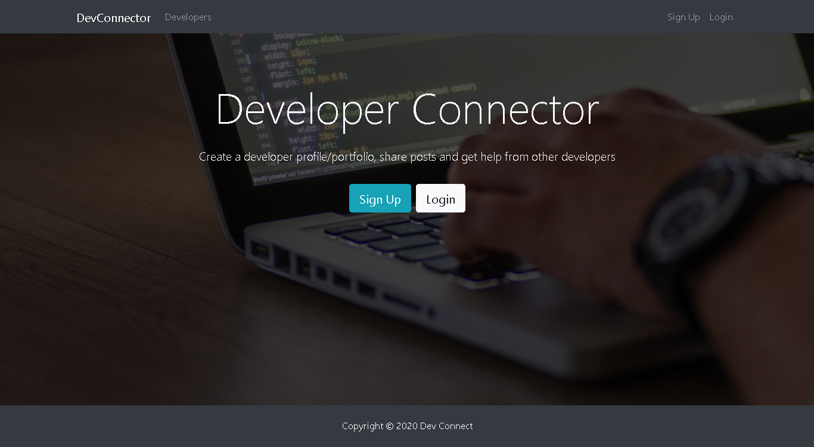</p>
<p align="center">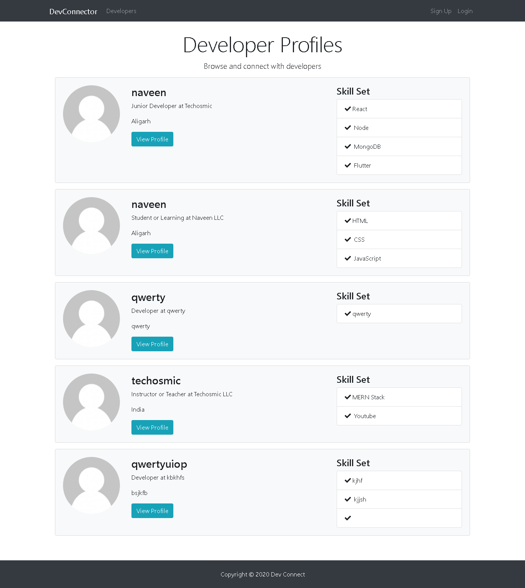</p>
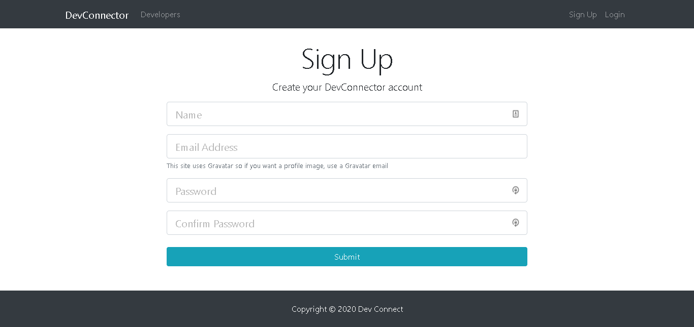
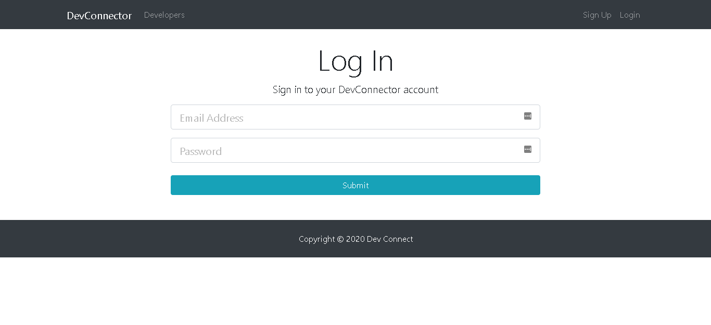
<p align="center">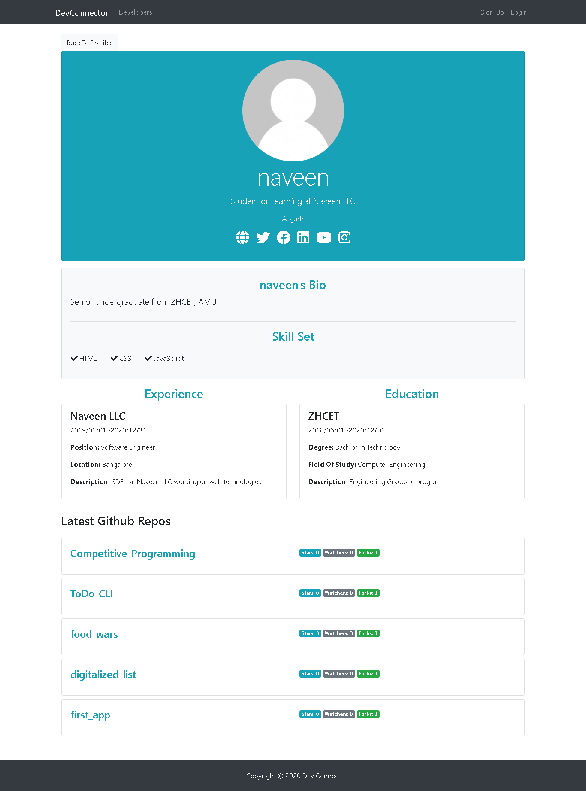</p>
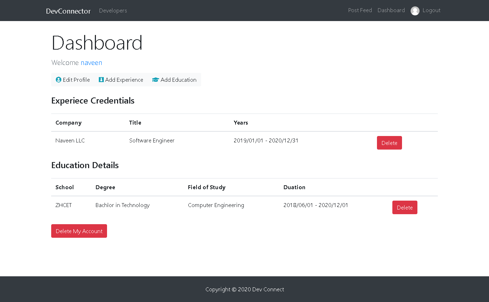
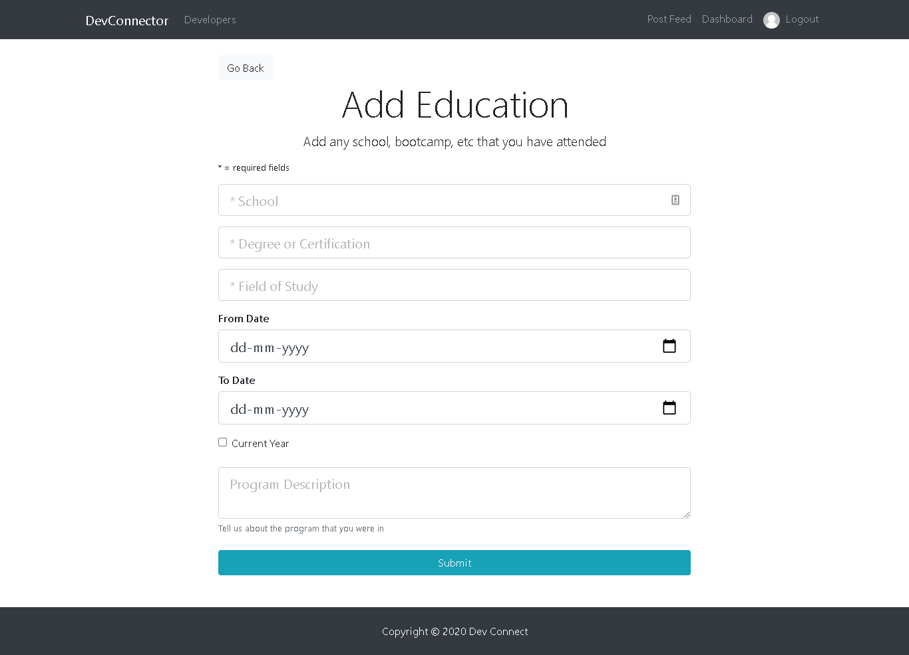
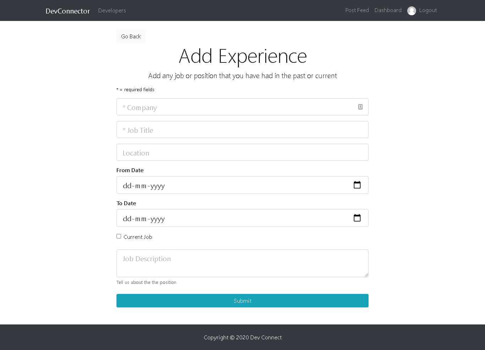
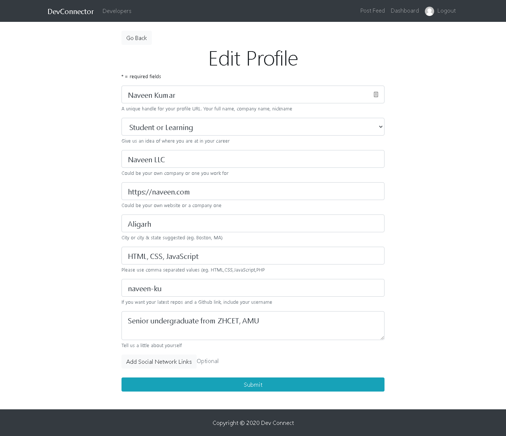
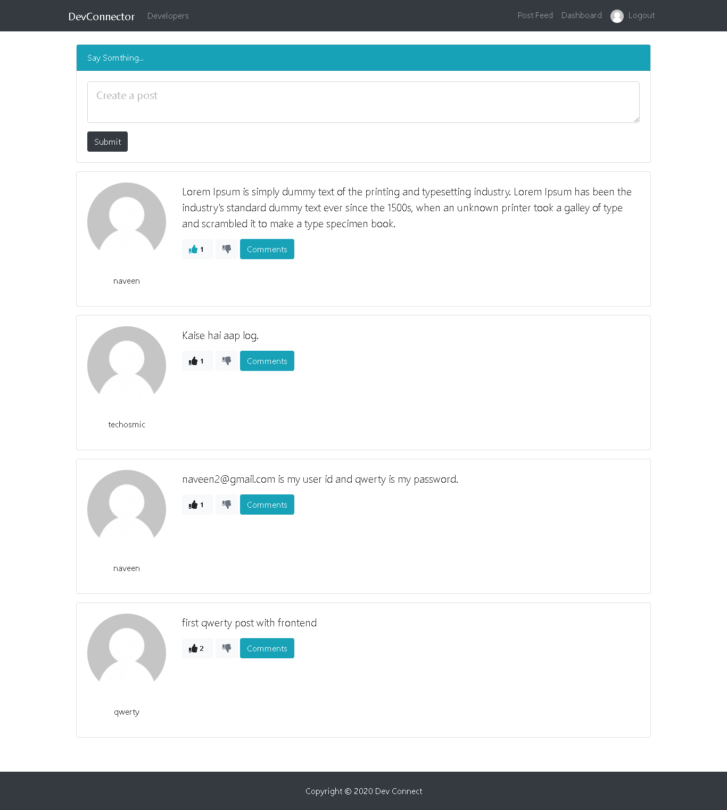
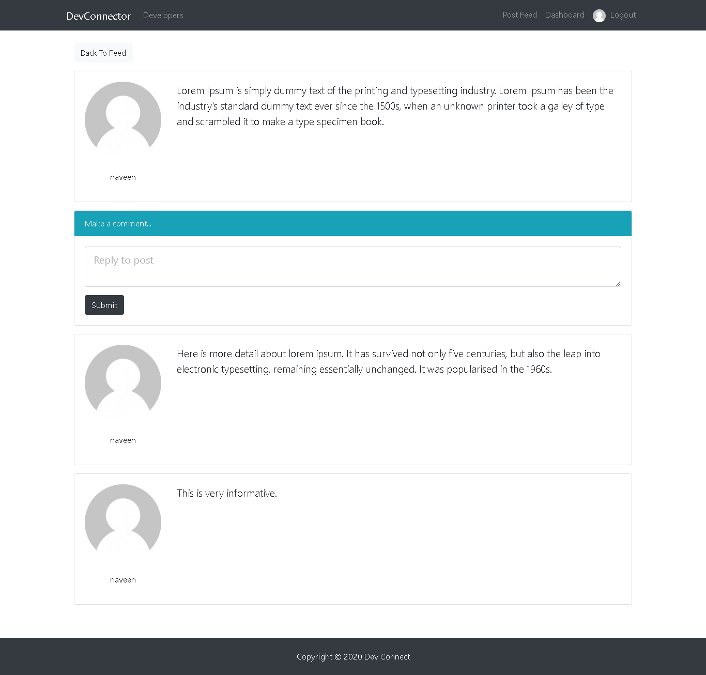

## Tech Stack

- **MongoDB** => NoSQL Database
- **ExpressJs** => Web Framework for NodeJs
- **ReactJs** => JavaScript library for front end
- **NodeJs** => JavaScript runtime environment

## Project Architecture

- `client` => contains Reactjs code for frontend
- `config` => contains keys and secret for connecting database
- `models` => contains database models
- `routes` => contains RESTful api/ end routes

## Run on localhost

To run the project on localhost follow the given steps in `root directory`. Open terminal and type following commands:

1. ```bash
   > npm install
   ```

2. ```bash
   > npm run client-install
   ```

3. Create a new cluster at [Mongodb atlas](https://www.mongodb.com/cloud/atlas). For this follow this [guide](https://docs.atlas.mongodb.com/tutorial/create-new-cluster/).

4. Connect the new cluster using this [guide](https://docs.atlas.mongodb.com/connect-to-database-deployment/)

5. ```bash
   > cd config && touch keys_dev.js
   ```

6. Write the following code in `keys_dev.js` and replace data inside quotation marks.

   ```javascript
   module.exports = {
     mongoURI: "YOUR_MONGODB_DATABASE_URL",
     secretOrKey: "SOME_INSANELY_SECRET_KEY_OF_YOUR_CHOICE", //For JWT payload token
   };
   ```

7. Run `node` server from **root directory** and `client` server from **client directory** by typing following commands in termimal:

   ```bash
   > npm run server
   > cd client
   > npm start
   ```

**<p align="center"> OR </p>**

8. Run following command from **root directory**:

   ```bash
   > npm run dev
   ```

## Deploy on Heroku

- Download [git](https://git-scm.com/book/en/v2/Getting-Started-Installing-Git)
- Download [heroku-cli](https://devcenter.heroku.com/articles/heroku-cli#download-and-install)
- Follow the given [guide](https://devcenter.heroku.com/articles/git)
